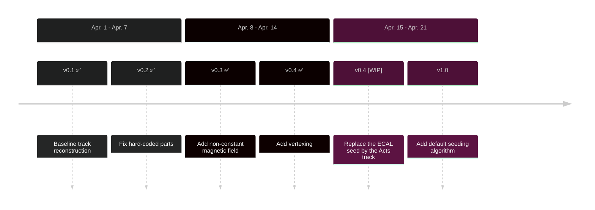

 

 </img>

---
layout: pageBar
hideInToc: true
---

# Outline

 

### <Toc />

---
layout: pageBar
---

# Track Efficency

## Tagging Track Number

| Eff | Inclusive | Signal 5 MeV |
| ---      | ---   | --- |
| Acts Tagging | **99.94%** | **99.94%** |
| DarkSHINE Tagging | 99.69%| 99.78% |
| Acts Recoil  | **99.76%** | 80.49 %|
| DarkSHINE Recoil | 99.27% | **87.55%** |

<Transform :scale="0.5">
<PlotlyGraph filePath="plots/json/Acts_TagTrk_No_cut1.json"/>
</Transform>
<Transform :scale="0.5">
<PlotlyGraph filePath="plots/json/Acts_RecTrk_No_cut2.json"/>
</Transform>

---
layout: pageBar
---

# PTrack Reconstruction Performance

## Tagging Tracker at Truth P = 8±0.5 GeV

<Transform :scale="0.7">
<PlotlyGraph filePath="plots/json/dTagTrk2_pp_8_cut2.json"/>
</Transform>

<Transform :scale="0.7">
<PlotlyGraph filePath="plots/json/dActs_TagTrk_P_8_cut2.json"/>
</Transform>

---
hideInToc: true
layout: pageBar
---

# PTrack Reconstruction Performance

## Recoil Tracker at Truth P = 1±0.5 GeV

<Transform :scale="0.7">
<PlotlyGraph filePath="plots/json/dRecTrk2_pp_1_cut2.json"/>
</Transform>

<Transform :scale="0.7">
<PlotlyGraph filePath="plots/json/dActs_RecTrk_P_1_cut2.json"/>
</Transform>

---
hideInToc: true
layout: pageBar
---

# PTrack Reconstruction Performance

## Recoil Tracker at Truth P = 2±0.5 GeV

<Transform :scale="0.7">
<PlotlyGraph filePath="plots/json/dRecTrk2_pp_2_cut2.json"/>
</Transform>

<Transform :scale="0.7">
<PlotlyGraph filePath="plots/json/dActs_RecTrk_P_2_cut2.json"/>
</Transform>

---
hideInToc: true
layout: pageBar
---

# PTrack Reconstruction Performance

## Recoil Tracker at Truth P = 3±0.5 GeV

<Transform :scale="0.7">
<PlotlyGraph filePath="plots/json/dRecTrk2_pp_3_cut2.json"/>
</Transform>

<Transform :scale="0.7">
<PlotlyGraph filePath="plots/json/dActs_RecTrk_P_3_cut2.json"/>
</Transform>

---
hideInToc: true
layout: pageBar
---

# PTrack Reconstruction Performance

## Recoil Tracker at Truth P = 4±0.5 GeV

<Transform :scale="0.7">
<PlotlyGraph filePath="plots/json/dRecTrk2_pp_4_cut2.json"/>
</Transform>

<Transform :scale="0.7">
<PlotlyGraph filePath="plots/json/dActs_RecTrk_P_4_cut2.json"/>
</Transform>

---
hideInToc: true
layout: pageBar
---

# PTrack Reconstruction Performance

## Recoil Tracker at Truth P = 5±0.5 GeV

<Transform :scale="0.7">
<PlotlyGraph filePath="plots/json/dRecTrk2_pp_5_cut2.json"/>
</Transform>

<Transform :scale="0.7">
<PlotlyGraph filePath="plots/json/dActs_RecTrk_P_5_cut2.json"/>
</Transform>

---
hideInToc: true
layout: pageBar
---

# PTrack Reconstruction Performance

## Recoil Tracker at Truth P = 6±0.5 GeV

<Transform :scale="0.7">
<PlotlyGraph filePath="plots/json/dRecTrk2_pp_6_cut2.json"/>
</Transform>

<Transform :scale="0.7">
<PlotlyGraph filePath="plots/json/dActs_RecTrk_P_6_cut2.json"/>
</Transform>

---
hideInToc: true
layout: pageBar
---

# PTrack Reconstruction Performance

## Recoil Tracker at Truth P = 7±0.5 GeV

<Transform :scale="0.7">
<PlotlyGraph filePath="plots/json/dRecTrk2_pp_7_cut2.json"/>
</Transform>

<Transform :scale="0.7">
<PlotlyGraph filePath="plots/json/dActs_RecTrk_P_7_cut2.json"/>
</Transform>

---
hideInToc: true
layout: pageBar
---

# PTrack Reconstruction Performance

## Recoil Tracker at Truth P = 8±0.5 GeV

<Transform :scale="0.7">
<PlotlyGraph filePath="plots/json/dRecTrk2_pp_8_cut2.json"/>
</Transform>

<Transform :scale="0.7">
<PlotlyGraph filePath="plots/json/dActs_RecTrk_P_8_cut2.json"/>
</Transform>

---
layout: pageBar
---

# ActsSequencer Development Plan

 

---
hideInToc: true
layout: center
class: "text-center"
---

# Thanks

[Git Repo](https://code.ihep.ac.cn/darkshine/darkshine-simulation/-/tree/acts-xuliang)

