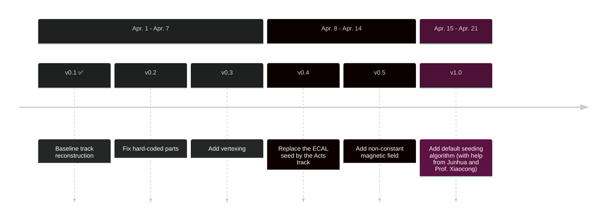

<br>

 </img>

<style scoped>
#ATLAS {
  width: 160px;
  position: absolute;
  right: 3%;
  bottom: 4%;
  /* background-color: #2B90B6;
  background-image: linear-gradient(45deg, #4EC5D4 15%, #146b8c 50%); */
}
</style>

---
layout: pageBar
hideInToc: true
---

# Outline

<br>

<div class="flex justify-center items-center" style="height: 50vh;">

### <Toc />

</div>

---
layout: pageBar
---

# Introduction to DAna ActsSequencer

<br>

**In order to use Acts in Dark SHINE DAna, these updates are made:**

1. Environment solution: DarkSHINE Docker
2. A customized version of `Acts` in the Docker
3. DAna ActsSequencer
4. Misc items

---
hideInToc: true
layout: pageBar
---

# Introduction to DAna ActsSequencer
## Environment solution: DarkSHINE Docker

[Docker repository](https://hub.docker.com/repository/docker/ykrsama/darkshine-simulation/general) | [Dockerfile](https://gitlab.com/ykrsama/darkshine-docker/-/blob/master/Dockerfile)

[Getting started guide](https://2024-winter-software-tutorial-darkshine-knowledg-6537bc19186da3.gitlab.io/prereqs-mac.html)

## Customized Acts in the Docker (based on Acts v30.2)

Acts prefered python. The old C++ examples are deprecated in Acts. To make use the power of C++, we modified CMakeLists to installed shared library for. This modification is not included in the official Acts, but in our Docker.

---
hideInToc: true
layout: pageBar
---

# Introduction to DAna ActsSequencer
## DAna ActsSequencer Algorithm

<br>

Default Acts **Event Store Data** management is still take control by Acts itself. And simply use DAna framework to manage the Acts **Algoritm Sequence**. There are 2 Class added to the DAna framework: `ActsSequencer` and `ActsSequencerContext`.

Access of Event Store Data are done by calling the WriteDataHandle and ReadDataHandle. The data are stored in the `ActsExamples::AlgorithmContext` class.

---
hideInToc: true
layout: pageBar
---

# Introduction to DAna ActsSequencer
## DAna ActsSequencer Algorithm - ActsSequncerContext Class

Setup algorithm configs and sequence:

```cpp {1-7|8-22|all}
int ActsSequencerContext::setup(const std::vector<std::string>& arguments) {
    /*...*/
    // Setup the detector geometry
    geometry = ActsExamples::Geometry::build(*variables, detector);
    trackingGeometry = geometry.first;
    // Set up the magnetic field
    magneticField = ActsExamples::Options::readMagneticField(*variables);

    std::string outputTrackParameters;
    setupSimHitReader();
    setupDigitization();
    if (truthSmearedSeeded) {
        setupParticleReader();
        setupParticleSelector();
        setupParticleSmearing();
        outputTrackParameters = particleSmearingCfg.outputTrackParameters;
    } else {
        setupSpacePointMaker();
        setupSeedingAlgorithm();
    }
    setupCKFTrackFinder(outputTrackParameters);
    setupTracksToTrajectories();

    return EXIT_SUCCESS;
}
```

---
hideInToc: true
layout: pageBar
---

# Introduction to DAna ActsSequencer
## DAna ActsSequencer Algorithm - ActsSequncer Class

Event loop:

```cpp {3-9|10-14|14-18|all}
void ActsSequencer::ProcessEvt(AnaEvent *evt) {
    InitEvt();
    for (auto detector : detectors) {
        // Event Store. store arbitary data with ownership transfer
        ActsExamples::WhiteBoard eventStore(Acts::getDefaultLogger("EventStore#" + std::to_string(evt->getEventId()),
                                                                   actsContext.at(detector)->logLevel),
                                            actsContext.at(detector)->whiteboardObjectAliases);
        // Aggregated information to run one algorithm over one event
        ActsExamples::AlgorithmContext context(0, evt->getEventId(), eventStore);
        // Transfer data from DEvent to Acts Event Store
        SimHitsReader(evt, ++context, detector);
        if (actsContext.at(detector)->truthSmearedSeeded) {
            ParticleReader(evt, ++context, detector);
        }
        // Execute Acts algorithm sequence
        for (const auto& alg : actsContext.at(detector)->sequenceElements) {
            alg->internalExecute(++context);
        }
    }
    // Read output values from context
    /*...*/
}
```

---
hideInToc: true
layout: pageBar
---

# Introduction to DAna ActsSequencer
## Misc items

<br>

- For **DSimu** simulation, turned on **Saving MCParticle contribution** on tracker / calorimeter hit (Need to re-run the DSimu).
    - It's usefull to save the MCParticle contribution of hit is useful for the ActsSequencer, and even studies of ECAL / HCAL.

- Rename macro object `DEBUG` to `DSIMU_DEBUG` in all scope, including DSimu, DAna, DDis.

- Moved this enum from `Digitization.h` to `AnaData.h`, in order to use it in ActsSequencer.
```cpp
namespace tracking
{
    enum detector {tag = 1, rec = 2};
}
```

---
layout: pageBar
---

# Samples and configs

| Type | $m_{A'}$ (MeV) | Event Number |
| --- | --- | --- |
| Inclusive | - |  $1\times 10^{5}$ |
| Signal | 5 | $1\times 10^{5}$ |

DAna Config:
```python
ActsSequencer.truth_smeared_seeded = 1  # Use track parameters smeared from truth particles for steering CKF

Tracking.Rec_fit_method = 2  # Specify fitting method: 0, no fine fitting; 1, Kalman fitting; 2, Riemann fitting
Tracking.Tag_fit_method = 2  # Specify fitting method: 0, no fine fitting; 1, Kalman fitting; 2, Riemann fitting
Tracking.clean = 0  # Clean mode: no truth information
Tracking.if_smear = 1  # If smear hits in strip structure
Tracking.if_strip = 1  # If use strip structures in trackers
Tracking.skip_hits_geq = 40  # Skip tagging/recoil tracker reconstruction if total hits number >= N in this tracker region (N<=0: infinite)
Tracking.verbose = 0  # Verbose
Tracking.con_field = -1.5  # Const magnet field
Tracking.remove_hit_less_E = 0.02  # [MeV] Remove small energy deposition that should not counted s a hit. Apply on raw hits.
```

---
hideInToc: true
layout: pageBar
---

# Samples and configs

Acts config:

<div grid="~ cols-2 gap-2">

```cpp
void ActsSequencerContext::setupParticleSelector() {
    particleSelectorCfg.inputParticles = particleReaderCfg.outputParticles;
    particleSelectorCfg.inputMeasurementParticlesMap = digiCfg->outputMeasurementParticlesMap;
    particleSelectorCfg.outputParticles = "particles_selected";
    particleSelectorCfg.ptMin = 0._MeV;
    particleSelectorCfg.nHitsMin = 5;
    particleSelectorCfg.nHitsMax = 40;
    particleSelectorCfg.etaMin = -7.0;
    particleSelectorCfg.etaMax = 7.0;
    particleSelectorCfg.rhoMin = -10.0 * Acts::UnitConstants::m;
    particleSelectorCfg.rhoMax = 10.0 * Acts::UnitConstants::m;
    particleSelectorCfg.zMin = -10.0 * Acts::UnitConstants::m;
    particleSelectorCfg.zMax = 10.0 * Acts::UnitConstants::m;
    addAlgorithm(std::make_shared<ActsExamples::TruthSeedSelector>(particleSelectorCfg, logLevel));
}
```

```cpp
void ActsSequencerContext::setupParticleSmearing() {
    particleSmearingCfg = ActsExamples::Options::readParticleSmearingOptions(*variables);
    particleSmearingCfg.inputParticles = particleSelectorCfg.outputParticles;
    particleSmearingCfg.outputTrackParameters = "smearedparameters";
    particleSmearingCfg.randomNumbers = rnd;
    // configs
    particleSmearingCfg.sigmaD0 = 10 * Acts::UnitConstants::um;
    particleSmearingCfg.sigmaD0PtA = 1 * Acts::UnitConstants::um;
    particleSmearingCfg.sigmaD0PtB = 1 * Acts::UnitConstants::um;
    particleSmearingCfg.sigmaZ0 = 10 * Acts::UnitConstants::um;
    particleSmearingCfg.sigmaZ0PtA = 1 * Acts::UnitConstants::um;
    particleSmearingCfg.sigmaZ0PtB = 1 * Acts::UnitConstants::um;
    particleSmearingCfg.sigmaT0 = 0;
    particleSmearingCfg.sigmaPhi = 0.005 * Acts::UnitConstants::degree;
    particleSmearingCfg.sigmaTheta = 0.005 * Acts::UnitConstants::degree;
    particleSmearingCfg.sigmaPRel = 0.02; // relative momentum resolution
    addAlgorithm(std::make_shared<ActsExamples::ParticleSmearing>(particleSmearingCfg, logLevel));
}
```

</div>

---
layout: pageBar
---

# Algorithm CPU Performance

<br>

```
======================================================================
---------------------------> Run Summary <----------------------------
     Processor Name                     Execution Time / Event [sec]
     Digitizer                               0.00014907
     MCTruthAnalysis                         0.00001287
     Tracking                                0.00086278
     ActsSequencer                           0.00198477
     RecECAL                                 0.00245720
     RecHCAL                                 0.00000270
     CutFlowAnalysis                         0.00000068
----------------------------------------------------------------------
     Total Processed Event(s): 100000
     Total Processing Time:    742.86003200 [sec]
======================================================================
```

No longer need to set cuts i.e. `Tracking.skip_hits_geq = 40` or `Tracking.remove_hit_less_E = 0.02` that looses tracking efficiency.

---
layout: pageBar
---

# P<sub>Track</sub> Reconstruction Performance

## Tagging Tracker at Truth P = 8±0.5 GeV

<div grid="~ cols-2 gap-2">

<Transform :scale="0.7">
<PlotlyGraph filePath="plots/json/dTagTrk2_pp_8_cut2.json"/>
</Transform>

<Transform :scale="0.7">
<PlotlyGraph filePath="plots/json/dActs_TagTrk_P_8_cut2.json"/>
</Transform>

</div>

---
hideInToc: true
layout: pageBar
---

# P<sub>Track</sub> Reconstruction Performance

## Recoil Tracker at Truth P = 1±0.5 GeV

<div grid="~ cols-2 gap-2">

<Transform :scale="0.7">
<PlotlyGraph filePath="plots/json/dRecTrk2_pp_1_cut2.json"/>
</Transform>

<Transform :scale="0.7">
<PlotlyGraph filePath="plots/json/dActs_RecTrk_P_1_cut2.json"/>
</Transform>

</div>

---
hideInToc: true
layout: pageBar
---

# P<sub>Track</sub> Reconstruction Performance

## Recoil Tracker at Truth P = 2±0.5 GeV

<div grid="~ cols-2 gap-2">

<Transform :scale="0.7">
<PlotlyGraph filePath="plots/json/dRecTrk2_pp_2_cut2.json"/>
</Transform>

<Transform :scale="0.7">
<PlotlyGraph filePath="plots/json/dActs_RecTrk_P_2_cut2.json"/>
</Transform>

</div>

---
hideInToc: true
layout: pageBar
---

# P<sub>Track</sub> Reconstruction Performance

## Recoil Tracker at Truth P = 3±0.5 GeV

<div grid="~ cols-2 gap-2">

<Transform :scale="0.7">
<PlotlyGraph filePath="plots/json/dRecTrk2_pp_3_cut2.json"/>
</Transform>

<Transform :scale="0.7">
<PlotlyGraph filePath="plots/json/dActs_RecTrk_P_3_cut2.json"/>
</Transform>

</div>


---
hideInToc: true
layout: pageBar
---

# P<sub>Track</sub> Reconstruction Performance

## Recoil Tracker at Truth P = 4±0.5 GeV

<div grid="~ cols-2 gap-2">

<Transform :scale="0.7">
<PlotlyGraph filePath="plots/json/dRecTrk2_pp_4_cut2.json"/>
</Transform>

<Transform :scale="0.7">
<PlotlyGraph filePath="plots/json/dActs_RecTrk_P_4_cut2.json"/>
</Transform>

</div>

---
hideInToc: true
layout: pageBar
---

# P<sub>Track</sub> Reconstruction Performance

## Recoil Tracker at Truth P = 5±0.5 GeV

<div grid="~ cols-2 gap-2">

<Transform :scale="0.7">
<PlotlyGraph filePath="plots/json/dRecTrk2_pp_5_cut2.json"/>
</Transform>

<Transform :scale="0.7">
<PlotlyGraph filePath="plots/json/dActs_RecTrk_P_5_cut2.json"/>
</Transform>

</div>

---
hideInToc: true
layout: pageBar
---

# P<sub>Track</sub> Reconstruction Performance

## Recoil Tracker at Truth P = 6±0.5 GeV

<div grid="~ cols-2 gap-2">

<Transform :scale="0.7">
<PlotlyGraph filePath="plots/json/dRecTrk2_pp_6_cut2.json"/>
</Transform>

<Transform :scale="0.7">
<PlotlyGraph filePath="plots/json/dActs_RecTrk_P_6_cut2.json"/>
</Transform>

</div>

---
hideInToc: true
layout: pageBar
---

# P<sub>Track</sub> Reconstruction Performance

## Recoil Tracker at Truth P = 7±0.5 GeV

<div grid="~ cols-2 gap-2">

<Transform :scale="0.7">
<PlotlyGraph filePath="plots/json/dRecTrk2_pp_7_cut2.json"/>
</Transform>

<Transform :scale="0.7">
<PlotlyGraph filePath="plots/json/dActs_RecTrk_P_7_cut2.json"/>
</Transform>

</div>

---
hideInToc: true
layout: pageBar
---

# P<sub>Track</sub> Reconstruction Performance

## Recoil Tracker at Truth P = 8±0.5 GeV

<div grid="~ cols-2 gap-2">

<Transform :scale="0.7">
<PlotlyGraph filePath="plots/json/dRecTrk2_pp_8_cut2.json"/>
</Transform>

<Transform :scale="0.7">
<PlotlyGraph filePath="plots/json/dActs_RecTrk_P_8_cut2.json"/>
</Transform>

</div>


---
layout: pageBar
---

# N<sub>Track</sub> Reconstruction Performance

## Tagging Track Number

<div grid="~ cols-3 gap-2">

<Transform :scale="0.5">
<PlotlyGraph filePath="plots/json/TagTrk2_track_No_truth_precut.json"/>
</Transform>

<Transform :scale="0.5">
<PlotlyGraph filePath="plots/json/TagTrk2_track_No__precut.json"/>
</Transform>

<Transform :scale="0.5">
<PlotlyGraph filePath="plots/json/Acts_TagTrk_No_precut.json"/>
</Transform>

</div>

---
hideInToc: true
layout: pageBar
---

# N<sub>Track</sub> Reconstruction Performance

## Tagging Track Number

<div grid="~ cols-3 gap-2">

<Transform :scale="0.5">
<PlotlyGraph filePath="plots/json/RecTrk2_track_No_truth_precut.json"/>
</Transform>

<Transform :scale="0.5">
<PlotlyGraph filePath="plots/json/RecTrk2_track_No__precut.json"/>
</Transform>

<Transform :scale="0.5">
<PlotlyGraph filePath="plots/json/Acts_RecTrk_No_precut.json"/>
</Transform>

</div>

---
layout: pageBar
---

# ActsSequencer Development Plan

<br>



---
hideInToc: true
layout: center
class: "text-center"
---

# Thanks

[Git Repo](https://code.ihep.ac.cn/darkshine/darkshine-simulation/-/tree/acts-xuliang)

